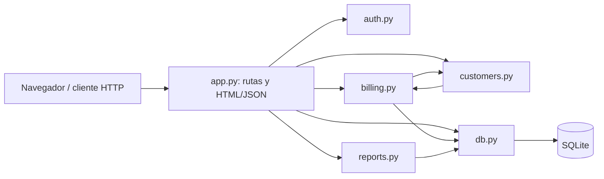
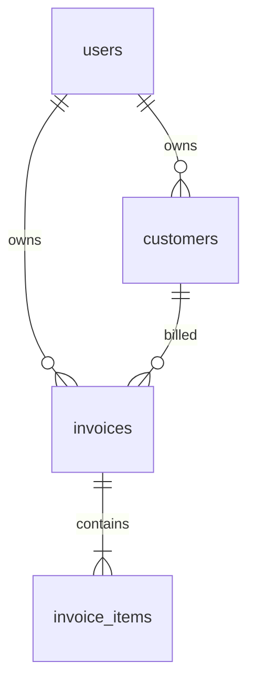

# Arquitectura observada

Consulta JSON: `GET /invoices/{id}` → `auth.login_required` → `db.invoice_by_id` → `db.invoice_items` → conversión de importes con `utils.amount` → JSON. El mismo identificador sirve para la vista HTML con sufijo `/view`.

Los importes se almacenan como texto decimal y se convierten con `Decimal`. Cada precio unitario tiene dos decimales; la línea es `cantidad × precio`, redondeada a centavos con `ROUND_HALF_UP`. El subtotal suma líneas. Si alcanza 100.00, el descuento de facturación es `subtotal × 0.075`, redondeado una sola vez a centavos. El total es `subtotal − descuento`.
