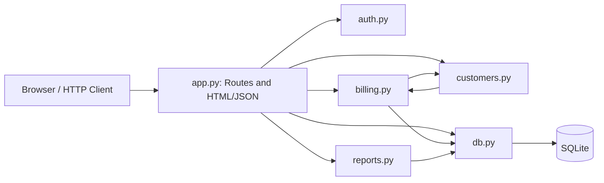
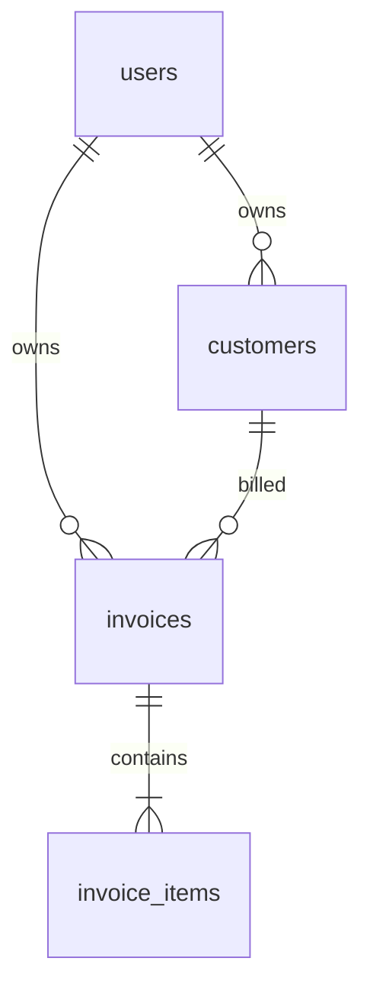

# Observed Architecture

```mermaid
flowchart LR
  browser[Browser / HTTP Client] --> app[app.py: Routes and HTML/JSON]
  app --> auth[auth.py]
  app --> billing[billing.py]
  app --> customers[customers.py]
  app --> reports[reports.py]
  app --> db[db.py]
  billing --> customers
  customers --> billing
  billing --> db
  reports --> db
  db --> sqlite[(SQLite)]
```

```mermaid
erDiagram
  users ||--o{ customers : owns
  users ||--o{ invoices : owns
  customers ||--o{ invoices : billed
  invoices ||--|{ invoice_items : contains
```

JSON Query Flow: `GET /invoices/{id}` → `auth.login_required` → `db.invoice_by_id` → `db.invoice_items` → amount conversion via `utils.amount` → JSON response. The same identifier is used for the HTML rendering with the `/view` suffix.

Monetary amounts are stored as decimal text and parsed with `Decimal`. Each unit price has two decimal places; line totals are computed as `quantity × unit_price`, rounded to cents using `ROUND_HALF_UP`. The subtotal sums all line totals. If the subtotal reaches 100.00, the billing discount is calculated as `subtotal × 0.075`, rounded once to cents. The final total is `subtotal - discount`.
